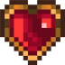
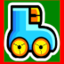
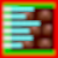
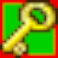

# PyDyna
# Клон игры Dyna Blaster
## История
Герой - служитель культа ходит по подземельям зачарованного замка и уничтожает нечисть чудо-жижей. Дорогу ему преграждают стены - но нет преград для чудо-жижи.

## Управление
- Стрелки на клавиатуре - направление движения героя
- SPACE - поставить сосуд с чудо-жижей, который взорвется через 2 секунды
- RETURN - взорвать сосуд, если есть детонатор
- ESC - выйти в главное меню

## Игра
После запуска игры и проигрывания заставки пользователь попадает в главное меню. 
В главном меню пользователю предлагается 3 варианта
- Начать игру с первого раунда первого уровня
- Начать игру с сохраненного после нескольких неудач раунда по паролю
- Завершить игру

Игра состоит из нескольких уровней, каждый из которых состоит из 8 раундов. 
По раунду герой перемещается используя стрелки на клавиатуре.
Для уничтожения нечисти герой использует чудо-жижу, расставляя склянки с жижей на свободных местах игрового поля.
Чтобы перейти из одного раунда в другой, герой должен активировать портал, уничтожив всю нечисть в текущем раунде. Портал скрыт под одной из стен.
За уничтожение нечисти и другие действия в игре герою начисляются очки.
Длительность раунда - 5 минут. По истечении 5 минут - появляется новая порция очень быстрой нечисти, и герой в основном погибает.
Статус игры отображается поверх верхней стены игрового поля.

8-й раунд каждого уровня - босс. После 8-го раунда - переход на следующий уровень.
На игровом поле каждого раунда под одной из стен скрыто сокровише - дополнительная способность героя. Этих способностей - 9:
-  (life) дополнительная жизнь
-  (speed) увеличение скорости героя
-  (bomb) дополнительный сосуд с чудо-жижей
-  (explosion) увеличивает силу взрыва сосуда с чудо-жижей
-  (fly) возможность летать над стенами
-  (remote) возможность дистанционного взрыва сосудов с чудо-жижей
-  (killer) возможность истреблять нечисть голыми руками при встрече
-  (eXit) возможность перехода в портал, не уничтожив нечисть в текущем раунде
-  (decspeed) уменьшение скорости героя

Представители монстров тоже имеют разнообразные способности:
- количество жизней
- скорость
- вероятность смены направления движения
- возможность летать над стенами

У монстров класса "босс" есть дополнительные способности:
- размер
- возможность периодически производить обычных монстров

При встрече героя с монстром монстр пожирает героя (если у героя нет способности "killer", в противном случае герой уничтожает монстра)
Когда сосуд с чудо-жижей взрывается, монстры и стены, попадающие в область его действия уничтожаются. После взрыва, жижа действует еще некоторое время. Герой со способностью "remote" может приводить в действие склянки с чудо-жижей в нужный ему момент, нажав на клавиатуре RETURN.

У героя 3 жизни. Когда герой погибает, он появляется заново в начале текущего раунда. 
Если жизни героя кончаются, игрок попадает в меню окончания игры, где ему предлагается либо пройти раунд заново с потерей всех очков (таких попыток может быть 3), либо выйти из игры. При этом игроку демонстрируется пароль, под которым сохраняется состояние игры (уровень/раунд). Игрок может записать пароль и вноследствии возобновить игру с текущего раунда/уровня (но с потерей всех игровых очков). Если игрок выбрал выход из игры - он попадает в главное меню, где может покинуть игру. Если попытки возобновить игру закончились - игрок может только выйти в основное меню (записав пароль).

На текущий момент есть 2 уровня по 8 раундов.


## Установка игры
### Установка из исходных текстов
#### Linux
```bash
sudo apt install freepats
python -m venv venv
source venv/bin/activate
pip install -r requirements.txt
./make-executable-linux.sh
```
 Собранный исполняемый файл будет в директории './.build/dist/linux/'
 

#### Windows
```cmd
python -m venv venv
venv/scripts/activate.bat
pip install -r requirements.txt
make-executable-windows.cmd
```
 Собранный исполняемый файл будет в директории './.build/dist/windows/'

### Установка из релизов github
- для linux - установить 
```bash
sudo apt install freepats
```
- скачать [релиз](https://github.com/MariaSutiagina/pydyna/releases/tag/v0.2) из раздела релизов проекта в github - для linux скачиваем *pydyna*, для windows - *pydyna.exe*

- для linux - установить флаг "исполняемый"
 ```bash
 chmod +x pydyna
 ```

- запустить исполняемый файл игры
